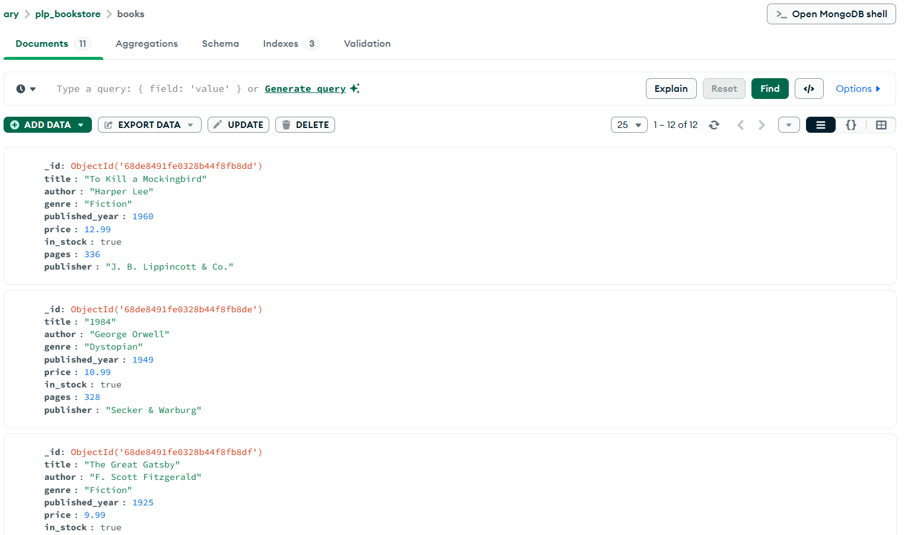

# MongoDB Fundamentals – Week 1

## 1. Setup Instructions

Before starting this assignment, ensure the following are installed:

- **MongoDB Community Edition** – [Installation Guide](https://www.mongodb.com/docs/manual/administration/install-community/)
- **MongoDB Shell (mongosh)** – included with MongoDB Community Edition
- **Node.js** – [Download here](https://nodejs.org/)

### Node.js Package Setup

In your assignment directory, run:

```bash
# Initialize a package.json file
npm init -y

# Install MongoDB Node.js driver
npm install mongodb
```

## 2. Assignment Overview

This week covers:

- Connecting to MongoDB databases
- CRUD operations (Create, Read, Update, Delete)
- MongoDB queries and filters
- Aggregation pipelines
- Indexing for performance

## 3. Getting Started

1. Accept the GitHub Classroom assignment invitation
2. Clone your personal repository
3. Install MongoDB locally or set up a MongoDB Atlas account
4. Run `insert_books.js` to populate your database
5. Complete the tasks in the assignment document

## 4. Included Files

- `Week1-Assignment.md` – Detailed assignment instructions
- `insert_books.js` – Script to populate sample book data
- `queries.js` – All MongoDB queries for CRUD, advanced queries, aggregation, and indexing

## 5. Running Your Queries Script

1. Ensure your database has data:

```bash
node insert_books.js
```

2. Run your queries:

```bash
node queries.js
```

**What it does:**

- Executes CRUD operations
- Runs advanced queries with filtering, sorting, and pagination
- Performs aggregation pipelines
- Creates indexes and checks query performance

Results are printed in the console.

## 6. MongoDB Collections Screenshot

Below is a screenshot of the `books` collection in MongoDB Compass:

*(
)*

## 7. Requirements

- Node.js (v18 or higher)
- MongoDB (local installation or Atlas account)
- MongoDB Shell (mongosh) or MongoDB Compass

## 8. Resources

- [MongoDB Documentation](https://docs.mongodb.com/)
- [MongoDB University](https://university.mongodb.com/)
- [MongoDB Node.js Driver](https://mongodb.github.io/node-mongodb-native/)
